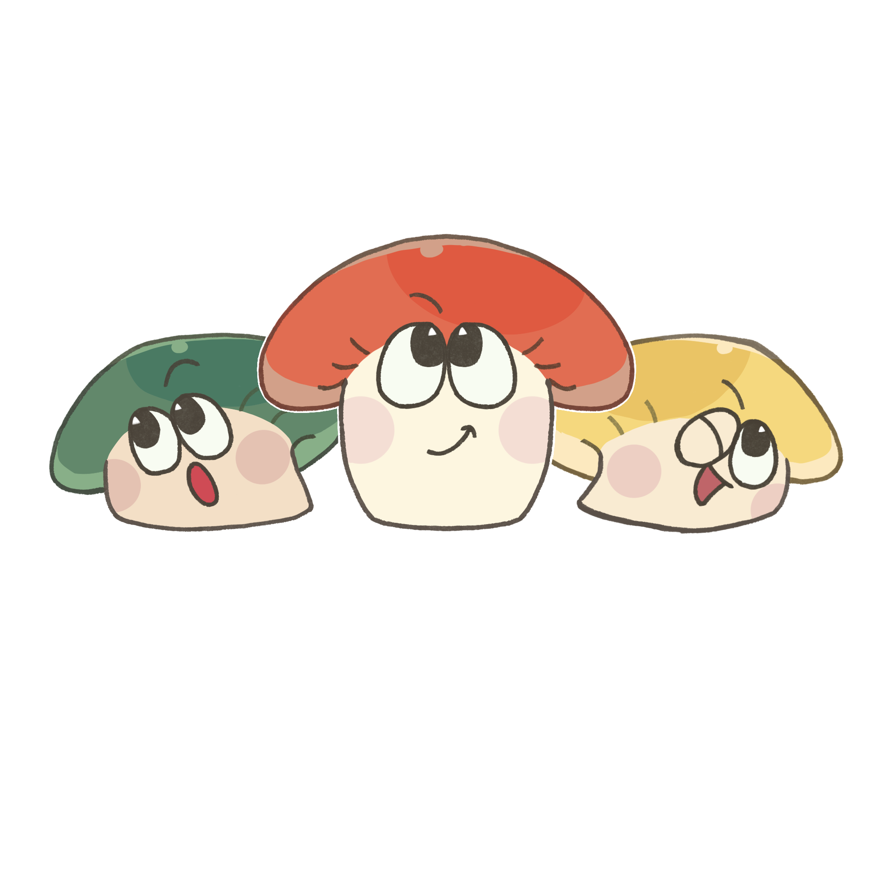
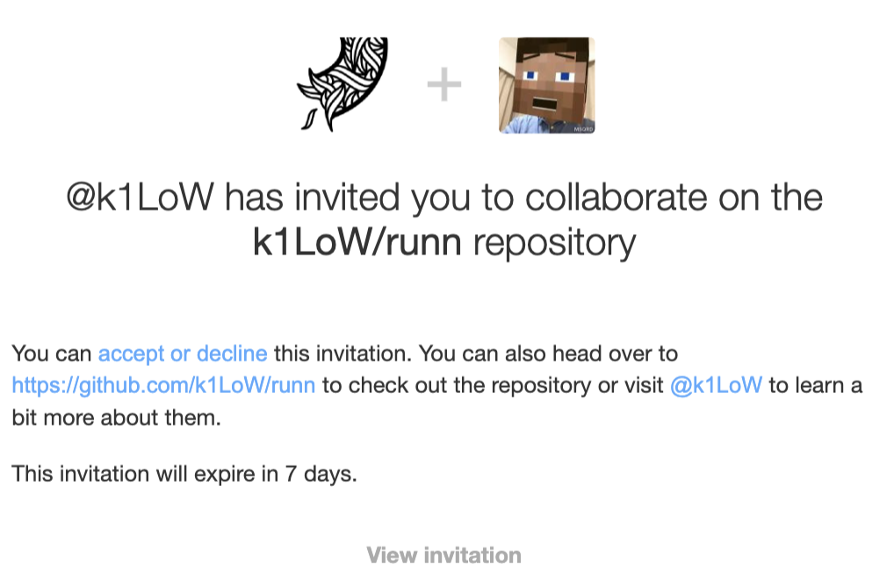

---
# You can also start simply with 'default'
theme: seriph
title: 推しは推せるときに推せ！ライフステージ変化に向き合う
info: |
  エンジニアがこの先生きのこるためのカンファレンス2026
  https://fortee.jp/kinoko-2026/proposal/9fcb212e-f5d8-4f7f-94ad-cda8478712b8
class: text-center
drawings:
  persist: false
transition: slide-left
seoMeta:
  ogImage: auto
duration: 20min
timer: stopwatch
mdc: true
highlighter: shiki
css: unocss
colorSchema: auto
routerMode: hash
ttsConfig:
  voiceName: "ja-JP-Neural2-B"
  languageCode: "ja-JP"
  clickBreakTime: "500ms"
  usePregenerated: false
  dictionary:
    - from: "runn"
      to: "ランエヌ"
    - from: "EC畑"
      to: "イーシーばたけ"
    - from: "実は"
      to: "じつは"
    - from: "YAML"
      to: "ヤムル"
    - from: "k1LoW"
      to: "けーいちろー"  
    - from: "PR"
      to: "Pull Request"  
    - from: "PHPerKaigi"
      to: "ペチパー会議"  
    - from: "x上"
      to: "エックスじょう"  
    - from: "BaaS"
      to: "Backend as a Service"  
addons:
  - '@katzumi/slidev-addon-qrcode'
  - '@katzumi/slidev-addon-ogp-image'
  - '@katzumi/slidev-addon-tts'
  - slidev-addon-components
  - slidev-addon-rabbit
---

# 推しは推せるときに推せ！ ライフステージ変化に向き合う

エンジニアがこの先生きのこるためのカンファレンス 2026 June 28, 2026.  
v0.0.1  
@katzumi（かつみ）

  Press Space for next page <carbon:arrow-right />

  <button @click="$slidev.nav.openInEditor" title="Open in Editor" class="slidev-icon-btn">
    <carbon:edit />
  </button>
  <a href="https://github.com/k2tzumi/cherish-my-oshi-moment" target="_blank" class="slidev-icon-btn">
    <carbon:logo-github />
  </a>

  

<!--
本日は「推しは推せるときに推せ！ライフステージ変化に向き合う」というタイトルで、お話しさせていただきます。  
どうぞよろしくお願いいたします。
-->

---
transition: slide-left
layout: two-cols-header
class: text-left
---

# <carbon-user-avatar /> 自己紹介

katzumi（かつみ）と申します。

以下のアカウントで活動しています。

::left::

  
  <QRCode value="https://twitter.com/katzchum" class="w-28 h-28" />

  <simple-icons-x class="mr-2" />
  <a href="https://twitter.com/katzchum" target="_blank" class="font-bold">katzchum</a>

::right::

  

    
    

      

        <logos-github-octocat class="mr-2" />
        <a href="https://github.com/k2tzumi" target="_blank" class="font-bold">k2tzumi</a>
      

      

        <simple-icons-zenn class="mr-2 text-green-400" />
        <a href="https://zenn.dev/katzumi" target="_blank" class="font-bold">katzumi</a>
      

    

  

<!--
みなさん、こんにちは。「かつみ」と申します。  
ご覧のXとGitHub等で活動しています。
-->

---
layout: two-cols-header
transition: slide-left
---

# <carbon-information /> お願い 🙏

写真撮影、SNS での実況について

登壇者の励みになるので是非ともご意見やご感想など、フィードバック頂けると助かります mm  
スライドの内容は、すでに以下の場所で公開されていますので、ぜひお手元でご覧ください

* [forteeのプロポーザルページ](https://fortee.jp/kinoko-2026/proposal/9fcb212e-f5d8-4f7f-94ad-cda8478712b8)
* または <fa6-brands-square-x-twitter /> の投稿

::left::

<Transform :scale="2.0">
　　　🙆‍♀📷<ph-projector-screen-chart-light /> 
　　　🙅‍♂📹💸 
　　　🙅📸👨‍👦‍👦 
</Transform>

::right::

 
<Transform :scale="1.5">
<fa6-brands-square-x-twitter />
</Transform>
 
<a href="https://x.com/search?q=%23%E3%81%8D%E3%81%AE%E3%81%932026%20%23a&f=live">#きのこ2026 #a</a>

<!--
まずはじめにお願いです。写真撮影、SNSでの実況、大歓迎です。スライドも公開済みですので、ぜひハッシュタグをつけて、ご意見やご感想をフィードバックいただけると励みになります。
-->

---
transition: fade-out
---

# <carbon-presentation-file /> 本日のお話すること
推し駆動で人生が変わった話

  

    
🔇 PART 1

    
沈黙の数年間

    
対外アウトプット・ゼロの日々

  

  

    
⚡ PART 2

    
運命の出会い

    
OSSと推しとの出会い

  

  

    
🔄 PART 3

    
推し駆動 サイクル

    
フィードバックの連鎖

  

  

    
<mdi-stairs-up class="inline mr-1" />PART 4

    
ライフステージ を味方に

    
3つの追い風

  

  

    

      
        
        
        
      
      PART 5
    

    
推しは推せる ときに推せ

    
波乗りの戦略

  

<!--
本日は5つのパートでお話しします。  
私自身が40代前半まで「何者でもなかった」状態から、推し活動を通してどのように変化していったのか？  
その実体験を通して、「何かを始めるのに遅すぎることはないんだな」と、少しでも感じていただけたら嬉しいです。
-->

---
layout: center
transition: slide-left
class: py-4
---

# <mdi-clock-time-eight-outline /> Before: 40代になるまでの私

  
31歳：協力会社だけど営業同行して東京・大阪中心に日本全国出張の旅

  
32歳：協力会社間の抗争に負け自社に復帰。案件を一本釣りする為に単身引っ越し（8年ぶり2回目）

  
33歳：前職関連のリファラルでEC系ベンチャーに。ブラックな環境になじんむ

  
34歳：B社モールのPLに。3拠点最大50名規模に。ホテル住まい

  
35歳：モールリリース保守フェーズ。CMで死亡。部下の結婚式で弄られる

  
36歳：モール事業が早々に終焉。2匹目のドジョウはおらず本業サービスが辛い状態に

  
37歳：ゲーム会社に買われる。N社の本社(韓国)に呼ばれてサービスを説明。単身赴任へ切替

  
38歳：前職のリファラルでVGへ。ポイントメディアの中の人に

  
39歳：前職部下を協力会社として召喚し各種ポイント・アイテム交換の繋ぎこみ。大手とも連携

  
40歳：航空大手A社モールをローンチ。所属部署が統合される

  
41歳：転職。そしてコロナ禍へ——

  対外的なアウトプット、ゼロでした。

<!--
まず、自己紹介がてら40代になるまでの私を振り返ってみます。  
キャリアの初期は、地方のSES会社からベンチャー企業へと渡り歩きながら、ずっとEC畑一筋。大小さまざまなECサイトやモールの開発・運用を泥臭くやってきました。
そこから色々あって、旧VOYAGE　GROUPへ転職するなど、怒涛の10年でした。  
やってきたことは、技術営業っぽい動きから、プロジェクトリーダー、バックエンドエンジニア、SREまで幅広く。今どきのカッコつけた言い方をすると、フルスタック・フルサイクル的なものでした。でも実態はただの何でも屋でした。それでも、目の前の仕事には全力で向き合ってきたつもりでした。  
しかし、です。
[click] これだけいろいろやってきたのに、当時の私は『完全なる社内弁慶』でした。  
地方にいると技術コミュニティとの接点もほとんどなく、OSSにコントリビュートしたこともない。凄腕エンジニアたちは常にインターネットの向こう側の存在で、『すごいなぁ』とただ眺めているだけ。外の世界からは一切見えない、文字通り『何者でもないエンジニア』でした。

そんな私がどうやって対外的なアウトプットを始めるようになったのか、次のパートからお話しします
-->

---
transition: slide-up
---

# <mdi-trending-up /> After: 2023年以降の私

  

    <simple-icons-zenn class="text-5xl text-green-400 mb-3" />
    
Zenn

    <a href="https://zenn.dev/katzumi" target="_blank" class="text-sm text-green-700 dark:text-green-300">zenn.dev/katzumi</a>
    
65記事・Zenn Book著者 トータル1,328Likes

  

  

    <logos-github-octocat class="text-5xl mb-3" />
    
GitHub

    <a href="https://github.com/k2tzumi" target="_blank" class="text-sm text-slate-700 dark:text-slate-300">github.com/k2tzumi</a>
    
OSS貢献を拡大中 <a href="https://github.com/k1LoW/runn/issues?q=is%3Apr%20author%3Ak2tzumi%20sort%3Acreated-asc" class="text-slate-800 dark:text-slate-200 underline decoration-slate-400">runn開発</a>・他OSSにも貢献 自身のOSSも公開・開発

  

  

    <carbon-presentation-file class="text-5xl text-blue-400 mb-3" />
    
Docswell

    <a href="https://www.docswell.com/user/katzumi" target="_blank" class="text-sm text-blue-700 dark:text-blue-300">docswell.com/user/katzumi</a>
    
カンファレンス登壇多数 公開スライド21本

  

  

    <h3 class="text-5xl font-extrabold text-white mb-4">
      <mdi-account-arrow-right class="inline mr-2 text-amber-300" />
      あのゼロだった私と、同一人物です
    </h3>
    

      
        <mdi-calendar-star class="inline mr-2" />40代から、本格始動しました
      
    

  

<!--
では、アウトプットが全くなかった私が、今どれくらい変わったのか？  
現在はこんな感じになっています。  

Zennでの記事執筆、OSS貢献、各地のカンファレンスでの登壇。  
おかげさまで記事がバズったり、登壇の機会を頂いたりしています。  
こうしてカンファレンスの場に立っている自分は、30代の頃には想像すらできませんでした。  
[click] 全部、40代に入ってからです。  
何がきっかけでそうなったのか、順を追ってお話しします。
-->

---
transition: slide-left
layout: center
class: text-center
---

  

    🔇
  

  
PART 1

  

    沈黙の十数年間
  

  

    対外アウトプット・ゼロの日々
  

<!--
パート1。  
まず対外的なアウトプットがなかった期間についてお話します。
-->

---
transition: slide-left
layout: center
---

# <mdi-comment-question-outline /> 「自分には特別な強みなんてない」

  この気持ち、ありませんか？

  

    
😔

    
"対外的に活躍するエンジニアは 特別な人たちだ"

  

  

    
⏳

    
"年齢的にも今さら 始めても遅い気がする"

  

  

    
🏠

    
"子育て・家庭があって 時間が取れない"

  

  

    
🗣️

    
"語れるような ネタが自分にはない"

  

<!--
「自分には特別な強みなんてない」。そう思って過ごした時期が、私にもありました。  
[click] 対外的に活躍するエンジニアは特別な人たちだと思っていました。  
[click] 年齢的にも今さら始めても遅いかなと。  
[click] 子育てや家庭があって時間も取れない。  
[click] 語れるようなネタが自分にはない。  
……かつての私も、まさにそうでした。  
今日はそんな過去の自分に話しかけるつもりで、お話しします。
-->

---
transition: slide-left
---

# <carbon-building /> 前職にはあったもの：技術力評価会

  

    
<carbon-group class="inline mr-2" />Voyage Group（現 CARTA HOLDINGS）時代

    <ul class="space-y-3 text-base text-slate-800 dark:text-white">
      <li>周りはつよつよエンジニアのタレント集団</li>
      <li>半期ごとに技術的アウトプットを 発表する文化（技術力評価会）</li>
      <li>評価会は正直、プレッシャーもあり辛かった…</li>
    </ul>
  

  

    
<mdi-thought-bubble-outline class="inline mr-2" />心の中では

    <ul class="space-y-3 text-base text-slate-800 dark:text-white">
      <li>アウトプットはしていたが自発的ではなかった</li>
      <li>「評価されるために義務感でやっている」感が自分にはなじまなかった</li>
      <li>でも組織の枠を超えて活躍している人への 憧れはずっとあった</li>
    </ul>
  

<!--
前職には「技術力評価会」という制度がありました。  
半期ごとにアウトプットする場があり、つよつよエンジニアからフィードバックをもらえる環境でした。  
評価会は正直、プレッシャーもあって辛かったです。  
業務としてのアウトプットは出していたものの、「評価のためにやっている」という義務感が拭えず、しっくりきていませんでした。  
一方で、自分の意志で組織の枠組みを飛び越えて活躍しているエンジニアへの憧れは、ずっと心の中にありました。
-->

---
transition: slide-left
---

# <mdi-weather-lightning-rainy /> 転職＋コロナ禍＝アウトプットの場が消えた

  

    

      
🏢

      
事業会社へ転職

      
Web系ではない

    

    
＋

    

      
😷

      
コロナ禍

      
転職直後に直撃

    

    
＝

    

      
🔇

      
アウトプットの場

      
すべてゼロに

    

  

  

    

      <carbon-close-filled class="mr-3 text-red-600 dark:text-red-400 shrink-0" />
      技術力評価会 →
      事業会社なので存在しない
    

    

      <carbon-close-filled class="mr-3 text-red-600 dark:text-red-400 shrink-0" />
      社内LT会 →
      コロナでなくなった
    

    

      <carbon-close-filled class="mr-3 text-red-600 dark:text-red-400 shrink-0" />
      勉強会・カンファレンス →
      全滅
    

  

<!--
事業会社へ転職した直後に、すぐコロナ禍になってしまいました。  
[click] 前職にあった技術力評価会は、事業会社なので当然ありません。  
唯一あった社内LT会もコロナでなくなり、勉強会やカンファレンスも全滅。  
アウトプットできる場が、すべて消えてしまいました。
-->

---
transition: slide-up
---

# <mdi-broadcast-off /> 限定的なアウトプットでは広がりが見えなかった
Slack Bot Officer を自称する様になるものの

  

    

      
<mdi-lightbulb-outline class="inline mr-2" /> きっかけ

      <ul class="space-y-3 text-base text-slate-800 dark:text-white">
        <li><logos-slack-icon /> 社内Slackのworkspaceが少し寂しかった</li>
        <li><mdi-robot-outline /> 前職のworkspaceにはbot職人がいてその雰囲気が好きだった</li>
        <li><logos-typescript-icon /> ちょうどTypeScriptを学びたい時期だった</li>
      </ul>
    

    

      
<mdi-emoticon-wink-outline class="inline mr-2" />もうひとつの狙い

      
「部門を超えてエンジニアからのフィードバックを得るには、bot開発は良いムーブだ」という想いがありました

    

  

  

    
<carbon-warning-filled class="inline mr-2" />でも結局

    <ul class="space-y-3 text-base text-slate-800 dark:text-white">
      <li><mdi-check class="inline mr-2 text-green-600 dark:text-green-400" />会社の中では良い名刺代わりに</li>
      <li><carbon-close-filled class="inline mr-2 text-red-600 dark:text-red-400" />ただフィードバックループはない</li>
      <li><carbon-close-filled class="inline mr-2 text-red-600 dark:text-red-400" />一緒にbot作る仲間はいない</li>
      <li><carbon-close-filled class="inline mr-2 text-red-600 dark:text-red-400" />スポットな認知に留まる</li>
    </ul>
    

      <mdi-checkbox-blank-off-outline class="inline mr-1 text-red-600 dark:text-red-400" />対外的なアウトプットは ゼロのまま
    

  

<!--
そんな中、転職先のSlack workspace がどこか物静かで寂しく感じて、自分でBotを生やし始めました。  
前職にいた「Bot職人」への憧れもありましたし、TypeScriptの勉強として取り組みました。

気づけばBotの数もどんどん増えていって、そのうち社内で「Slack Bot Officer」を自称するようになりました。

[click] 実は、このBot開発の取り組みには狙いがあり、部門を超えてエンジニアからフィードバックをもらうのに良い手段だと思っていました。

[click] でも結局、社内での良い名刺代わりにはなったものの、そこから先への広がりはありませんでした。
継続したフィードバックがあるわけでもなく、外に出れない暇つぶしでした。  
リポジトリは増えたものの、積極的に外部発信することはありませんでした。

ここまでが「沈黙の十数年間」でした。
-->

---
transition: slide-left
layout: center
class: text-center
---

  

    ⚡
  

  
PART 2

  

    運命の出会い
  

  

    OSSと推しとの出会い
  

<!--
パート2。  
運命の出会いについてお話しします。
-->

---
transition: fade-out
---

# <carbon-api /> 転機：レセプトBaaSでの技術課題
スキーマ駆動×画面なし・複雑な請求フロー・シナリオテストへの渇望

  

    
<carbon-api class="inline mr-2" />課題

    <ul class="space-y-3 text-base text-slate-800 dark:text-white">
      <li>APIのみのサービス（BaaS）をスキーマ駆動で開発</li>
      <li>手動によるブラウザテストは不可</li>
      <li>コアドメインなので 早く品質を確保したい</li>
      <li>I/Fとして正しいことを 早く保証したい</li>
    </ul>
  

  

    
<carbon-search class="inline mr-2" />探していたもの

    
シナリオベースで APIテストができるツール

    
当時、そういうツールが少なかった

  

<!--
転機は、新しいシステム開発における技術的な課題から始まりました。  
画面を持たないAPI（BaaS）をスキーマ駆動開発する方針としましたが、画面がないので従来のブラウザテストが行えないという課題です。  
しかも請求処理は複数ステップにまたがり、組み合わせも膨大で、単体のAPIテストだけでは品質を担保できませんでした。  
シナリオベースでAPIテストできるツールが必要と考えましたが、当時はほとんど選択肢がありませんでした。
-->

---
layout: center
transition: slide-left
class: hide-global-bottom
---

  

<!--
そんなときに見つけたのが、このrunnというAPIシナリオテストツールでした。
-->

---
transition: slide-left
layout: center
---

# <carbon-document /> 衝撃的なrunnとの出会い

  <OgpImage url="https://tech.pepabo.com/2022/06/07/scenario-testing-in-go/" width="960" height="504" />

  作者のk1LoWさんの記事でrunnを知る

<!--
このツールを知ったのは、作者のk1LoWさんの記事でした。  
初見だったのですが、YAMLでAPIの呼び出し順を並べるだけでシナリオになる！  
直感的に「こうかけば動きそう！」と理解できました。  
「これだ！」と思って、すぐに試し始めたのが最初の一歩でした。
-->

---
transition: slide-left
---

# <logos-github-octocat /> 勇気を出して、最初のPull Requestを送る

  

    

      
<mdi-timeline-text-outline class="inline mr-2" />最初はうまく動かなかった

      

        
コードを読んでみると…

        

          
✅ Goがシンプル

          
✅ 初期段階でコード量が少ない

          
✅ ちょうどGoを勉強中だった

        

        
「自分でも分かるかも！」

      

    

  

  

    

      
<carbon-send-filled class="inline mr-2" />PR → マージ → 喜び → 繰り返す

      

        
すぐマージしてもらえた！

        
レセプトBaaSの開発が進むにつれて、 新しい課題が現れる

        
Issueで機能を提案・検討し、PRで改善を積み上げる

        
77 Pull Request

        

          小さな改善を積み上げた結果、 テストしているプロダクトの成長と一緒にrunnも育っていった
        

        
※ 累計コントリビュートPR数

      

    

  

<!--
しかし最初はうまく動きませんでした。  
動かない原因を調べるために、ソースコードを読んでみることにしました。

すると、runnはまだ初期段階でコード量が少なく、Go言語自体もシンプルで、当時Goを勉強中だった自分でも追える規模でした。  
「もしかして自分でもわかるのでは？」と感じて、動かなかった箇所を修正し、初めてのPRを送ってみました。

それがすぐにマージしてもらえました！  
一度受け入れてもらえると「次もいけるかも」と思えて、Issue作成やPRを積極的に送るようになりました。

BaaSの開発が進むにつれてrunnへの改善ポイントも次々と見つかり、気づけば送ったPRの数は現時点で77件になりました。
-->

---
transition: slide-left
---

# <carbon-email /> 小さな改善が、コミッターへの扉を開いた

  

    k1LoWさんに会う前、まだ 9PR くらいの時期。 
    改善提案を続けていたところ、リポジトリ招待が届いた
  

  
  

    「改善を積み上げると、信頼が返ってくる」
  

<!--
ある日、突然リポジトリへの招待が届きました。公式のコミッター権限です。  
まだリアルで対面すらしていない、送ったPRも10件に満たない頃でした。

振り返ると、k1LoWさんは自分の小さな改善や提案を毎回受け止めてくれて、議論にも丁寧に答えてくれていました。  
ディスカッションの中で、自分の提案の点と点をつないでコンセプトを汲み取って貰えたときは、本当に嬉しかったです。  
そして招待をもらったことで、「もっとコミットして、自分のアイデアも持ち寄りながら一緒にrunnを良くしていこう」という気持ちになりました。
-->

---
transition: fade-out
---

# <carbon-star /> それがぼくには楽しかったから
runn 開発で学び、気づけば変わっていた自分——k1LoW さんへの感謝

  

    
<mdi-school-outline class="inline mr-2" />runnで学んだこと

    <ul class="space-y-2 text-sm text-slate-800 dark:text-white">
      <li>開発者フレンドリーなツール設計（runn本体・tagprによるリリースプロセス）</li>
      <li>Documentation as Code の考え方</li>
      <li>CLIでもインタフェース設計が重要になるということ</li>
      <li>テスティングライブラリとCLIツールのバランス設計</li>
      <li>Goのモダンな開発スタイル</li>
    </ul>
  

  

    
<mdi-handshake-outline class="inline mr-2" />OSSで共同開発する楽しさ

    <ul class="space-y-2 text-sm text-slate-800 dark:text-white">
      <li>対話しながら機能を育てる、共創の面白さ</li>
      <li>発展的な機能拡張は、議論が難しいぶんワクワクする</li>
      <li>提案が形になり、ユーザー価値へつながる手応え</li>
    </ul>
  

  推し活で回るフィードバックサイクルが、エンジニアとしての成長を自然と後押しする

<!--
コミッターとして開発に参加していく中で、runn開発から多くを学びました。  
開発者フレンドリーな設計、Documentation as Code、CLIのインタフェース設計、ライブラリとCLIのバランス、そしてGoのモダンな開発スタイルも学びました。  
k1LoWさんとの機能拡張の議論は難しさもありつつも、その分ワクワクする機会をたくさん経験できました。  

リーナスの言葉を借りれば「それがぼくには楽しかったから」。　　

かつて特別な人たちだと思っていた「対外的に活躍するエンジニア」の世界に、気づけば自分もいる。ここまでの景色を見せてくれたk1LoWさんには、本当に感謝しかないです。
-->

---
transition: slide-left
---

# <mdi-account-group-outline /> ちゃまほりさんがつないでくれた縁

  
同僚の ちゃまほり（@tyamahori）さんが動いてくれた

  

    

      
      
katzumi

      
runnをドッグフーディング 改善提案を継続

    

    

      
      
ちゃまほりさん(@tyamahori)

      
PHPerRoomで アカセさんに打診

    

    

      
      
k1LoWさん

      
runnの作者

    

    

      
      
アカセさん(@akase244)

      
ツナギメエフエムで k1LoWさんとちゃまほりさんを繋いだ

    

  

  

    katzumi → ちゃまほりさん → アカセさん → k1LoWさん
  

  

    <mdi-calendar-heart class="inline mr-2" />
    PHPerKaigi 2023 で初めてお会いする機会が訪れた
  

  

    
  

<!--
ここまでの話、実はk1LoWさんとはまだ一度もリアルでお会いしていませんでした。  
実際にお会いするきっかけを作ってくれたのは、同僚のちゃまほりさんでした。  
PHPerRoomでアカセさんに打診してくれていました。  
そしてツナギメエフエムというPodcastでk1LoWさんとちゃまほりさんが共演しました。  
その流れでちゃまほりさんが自分をk1LoWさんに繋いでくれました  
[click] そしてPHPerKaigi 2023で、初めてお会いする機会が訪れました。  
[click] x上ではこんなやり取りをしていました。
-->

---
transition: slide-up
---

# <mdi-balloon /> PHPerKaigi 2023：カンファレンスの廊下を体験
hallway track の魅力

  

    

      

        k1LoWさんのセッションを客席で聴く　<carbon-presentation-file class="inline mr-1" />
      

      
"Win Testing Trophy Easily" runnが生まれた動機が語られる

    

    

      
<mdi-microphone class="inline mr-1" />登壇中のサプライズ言及

      
"データ駆動テストの拡張をしてくれたコントリビューターが本日会場に来てくれていると思います（ニヤリ）"

      
→ 想定外のタイミングで名指しされて驚く

    

  

  

    

      
<mdi-glass-mug-variant class="inline mr-1" />Day1 Night → Day2ホワイトボード

      
IssueやPRでの英語コミュニケーションとは全然違う。 対面で日本語で話すと、解像度が一気に上がる。 ハッカソン的にその場でコーディング。

    

    

      
<mdi-map-marker class="inline mr-1" />運命のひとこと

      
"福岡でPHPカンファレンスやりますよ" 「絶対参加しよう！」 （k1LoWさん・アカセさんは福岡在住）

    

  

  

<!--
そのPHPerKaigi 2023の当日。まずk1LoWさんのセッションをトラックで聴いていました。  
[click] そしたら登壇中に突然、「データ駆動テストの拡張をしてくれたコントリビューターが本日会場に来てくれていると思います」と触れられて、かなり驚きました。  
セッション後のAsk the Speakerで、ようやくk1LoWさんに直接「はじめまして」を伝えることができました。  
ネットでのやり取りのみだった方と、初めてリアルで会えた瞬間でした。   
[click] 普段はIssueやPRで英語コミュニケーションでしたが、日本語で対面で話すと解像度が一気に上がりました。  
Day2はホワイトボードでアイデアをぶつけ合い、その場でコーディングも行いました。カンファレンスの廊下の魅力を始めて実感しました  
[click] この写真は、その時に書き殴ったホワイトボードです。  
[click] そして「福岡でPHPカンファレンスやりますよ」という話を聞いて、「絶対参加しよう！」という気持ちになりました。
-->

---
transition: slide-left
layout: center
class: text-center
---

  

    🔄
  

  
PART 3

  

    推し駆動サイクル
  

  

    フィードバックの連鎖
  

<!--
パート 3  
推し駆動サイクルについてお話しします。
-->

---
transition: slide-left
---

# <mdi-fire /> 5本のプロポーザル——推し駆動の気合

  

    「推しに会いに行く」という動機で 
    PHPカンファレンス福岡2023にプロポーザル5本提出
  

  

    

      
5

      
本のプロポーザル

      
LT含む

    

    
→

    

      
🎉

      
採択！

      
前夜祭LTで初登壇

    

  

  

    <mdi-comment-quote-outline class="inline mr-2 text-slate-600 dark:text-white/80" />
    "プロポーザルが落ちても行くつもりでいた"
  

<!--
PHPカンファレンス福岡2023では、プロポーザルを5本提出しました。  
「推しに会いに行く！」という気合で。  
[click] 正直に言うと、プロポーザルが落ちても行くつもりでいました。  
でも幸い採択されて、前夜祭LTで初めての対外登壇を果たしました。
-->

---
transition: slide-left
---

# <mdi-cached /> サイクルが回り始めた
推し活動を狙いつつ地方カンファレンスを行脚しはじめる

  

    

      前夜祭LT「クリーンアーキテクチャのアンチパターン」
    

    
↓ フィードバックをもらう

    

      PHPカンファレンス沖縄「ActiveRecordパターンの呪縛を学びほぐす」
    

    
↓ 廊下でrunnへの要望・質問を受ける → 実装する

    

      各地のカンファレンス「APIカバレッジ計測」「モブワーク事例」など
    

    
↓ 改善内容がOSS化 → 次の登壇ネタに

    

      PHPカンファレンス福岡2025「アーキテクチャレベルの依存性逆転」
    

    
↓ そして今日のこのセッションへ

  

<!--
その後に各地の地方カンファレンスを行脚するというサイクルが生まれました。  
その頃、k1LoWさんも積極的にカンファレンスに参加されていました。

まず、福岡での前夜祭LTでフィードバックをもらい、そのネタを元にプロポーザルとして提出しました。  
[click] そしてそれが、PHPカンファレンス沖縄での登壇につながりました  
[click] またその登壇したカンファレンスの廊下でrunnへの要望や質問をもらって、それを持ち帰って実装する。その改善がまた次の登壇ネタになっていく——。  
[click] このサイクルが、自分でも驚くほどの速度で回り始めました。そして今日ここにいます。
-->

---
transition: slide-left
---

# <mdi-book-heart-outline /> 継続発信が、技術書執筆のきっかけになった

  

    

      

        
        runnの一人アドベントカレンダー<carbon-calendar class="inline mr-2" />
      

      

        
12/1から毎日runnの記事を書き続ける

        
→ Zennに連載記事シリーズ

      

    

    

      

        
        k1LoWさんから連絡<mdi-star class="inline mr-2" />
      

      
"本にしてみない？"

      
→ 二つ返事で引き受ける

    

  

  

    

      <simple-icons-zenn class="text-5xl text-green-400 mb-4" />
      
Zenn Book

      
"runnチュートリアル"

      

        <mdi-pen class="inline mr-2" />技術書著者 になりました
      

    

  

<!--
継続発信のエピソードをひとつ紹介します。  

runnの一人アドベントカレンダーです。12月1日から毎日、runnに関する記事をZennに投稿していました。  
[click] すると、k1LoWさんから「本にしてみない？」と声がかかりました。  
技術書典とか書いたこともなかった自分ですが、言われるがままホイホイ引き受けました。  
[click] こうして「runnチュートリアル」というZenn Bookを書き、技術書著者にもなりました。
-->

---
transition: fade-out
layout: center
---

# <simple-icons-zenn /> Zenn Book: runnチュートリアル

  <OgpImage url="https://zenn.dev/katzumi/books/runn-tutorial" width="960" height="504" />

  https://zenn.dev/katzumi/books/runn-tutorial

<!--
こちらが実際に書いたZenn Bookです。興味があればぜひよろしくお願いします。無料です！
-->

---
transition: slide-up
---

# <carbon-enterprise /> フィードバックが、OSS開発者への一歩になった

  

    

      
<carbon-presentation-file class="inline mr-2" />スキーマ駆動開発フローのスライドを公開

      
登壇・公開した内容に反響があった

    

    
↓

    

      
<logos-github-octocat class="inline mr-2" />eg-r2 をOSS化

      
所属会社として初めてのOSS化

    

  

  

    

      <mdi-cached class="text-6xl mb-5 text-pink-700 dark:text-pink-300" />
      
行動が変わったポイント

      

        外部公開によって 
        フィードバックサイクルを得られると実感し 
        OSS活動を続ける行動に変わった
      

    

  

<!--
もうひとつ、アウトプットが成長につながったエピソードです。   
飛び込みLTでスキーマ駆動開発フローを発表したところ、イベントでフィードバックをもらえて、それがeg-r2というライブラリのOSS化につながりました。  

所属会社として初めてのOSSです。  
[click] 活動を振り返ってみての気づきですが、OSS活動も含めて外部発信は「タイパ」が良いと感じています。  

なぜなら、【発信 ➔ 社外からのフィードバック ➔ 自身の成長 ➔ 社内への認知拡大】という強力な好循環が自然とできあがるからです。  

この価値を意識してからは、OSS活動を続ける行動に自然と変わっていきました。
-->

---
transition: slide-left
layout: center
class: text-center
---

  

    <mdi-stairs-up />
  

  
PART 4

  

    ライフステージを味方に
  

  

    3つの追い風
  

<!--
パート 4  
ライフステージの変化へに向き合う話をします
-->

---
transition: slide-left
layout: center
---

# <carbon-warning-alt /> アウトプットは、いつ始めるべきか？

  「余裕ができてから」で、本当に間に合うのか

  

    <h3 class="text-4xl font-extrabold text-white mb-6 leading-tight">
      <mdi-check-decagram class="inline mr-2 text-green-300" />「若いうちに頑張らないと手遅れ」ではない！ 私のケースの場合
    </h3>
    

      
        <mdi-account-child-outline class="inline mr-2" />40代・元地方在住・子育て世代
      
       
      
        → それでも、いまが人生最高のアウトプット期
      
    

  

<!--
「若いうちに頑張らないと手遅れ」という言説があります。  
[click] でもそれは本当でしょうか？  
内発的なアウトプットは、いつからでも遅くないと考えています。  
40代・元地方在住・子育て世代の私が、人生で今が一番アウトプットできています。
-->

---
transition: slide-up
---

# <mdi-weather-windy /> 3つの追い風
40 代からアウトプットし始めた私のケース。ライフステージの変化と、環境の変化がありました

  

    
👨‍👩‍👦

    
<mdi-numeric-1-circle class="inline mr-1" />子育てのフェーズ変化

    

      
一番下の子が中学生に

      
→ 部活が入り、親離れが進む

      
→ 「構ってもらえなくなる」タイミングで時間が生まれる

    

    

      <mdi-hand-wave-outline class="inline mr-1" />
      会場の皆さんはいかがですか？
    

  

  

    
🤖

    
<mdi-numeric-2-circle class="inline mr-1" />技術的障壁の低下

    

      
k1LoWさんのリポジトリは全英語

      
→ DeepLで乗り越えた

      
→ AIでコードリーディング・Issue化も

      
コミュニケーションや開発も含めて 言語的な障壁が少なくなりました

    

  

  

    
🗾

    
<mdi-numeric-3-circle class="inline mr-1" />コミュニティの成熟

    

      
地方カンファレンスが活発化

      
funabashi.dev・多摩.devなど マイクロコミュニティも誕生

      
元地方在住だからこそ 積極的に地方カンファへ

      
色々な人と知り合い・刺激を貰えるきっかけ

    

  

<!--
あくまで私のケースですが、3つの追い風がありました。  
[click] 一つ目が子育てのフェーズ変化。一番下の子が中学生になり、部活が入って親離れが進みました。「構ってもらえなくなる」タイミングで、逆に自分の活動時間が生まれました。  
[click] この点はみなさんのご家庭の事情にもよると思うので、ぜひ聞いてみたいところです。  
[click] 二つ目は技術的障壁の低下。  
k1LoWさんのリポジトリは全て英語でしたが、DeepLで乗り越えました。最近ではAIでコードリーディングやIssue化もできて、コミュニケーションも開発も含めて、言語的な障壁はかなり少なくなりました。  
[click] 三つ目はコミュニティの成熟。  
地方カンファレンスが活発化し、funabashi.devや多摩.devのようなマイクロコミュニティも次々と生まれています。元地方在住だからこそ、積極的に地方カンファレンスに参加したいという気持ちになっています。  
地方カンファレンスが今、凄く熱いと感じていて、また実際に参加すると凄く良い刺激をいつも頂いています。
-->

---
transition: slide-left
layout: center
class: text-center
---

  

    
      
      
      
      
      
    
  

  
PART 5

  

    推しは推せるときに推せ
  

  

    波乗りの戦略
  

<!--
最後
パート 5です。
-->

---
transition: slide-left
---

# <mdi-heart-broken-outline /> 一期一会：PHPカンファレンス福岡の終焉
「あの時行っておいてよかった」——動ける機会は永遠ではない

  

    

      
<mdi-candle class="inline mr-2" />10年の節目に幕引き

      

        
PHPカンファレンス福岡が10年目を節目に終了

        
実行委員長らから幕引きを宣言

        
去年（2025年）が最後になってしまった

        
k1LoWさんに会える身近なイベントがなくなり、凄く悲しい気持ち

      

    

    

      
<mdi-map-marker class="inline mr-2" />Go Conference mini in KYOTO

      
「押しかけ」で<a href="https://zenn.dev/katzumi/scraps/f00a2d3e177b77">runn開発者会議 in 鴨川</a>を開催 憧れのはてな社にもお邪魔できた → あの時行っておいてよかった

    

  

  

    

      
コミュニティも

      
憧れのエンジニアとの接点も

      
自分の「動ける状況」も

      
永遠ではない

    

  

<!--
PHPカンファレンス福岡が、10年目を節目に幕を閉じました。  
実行委員長らアカセさん達が幕引きを宣言されていて、去年が最後の開催になってしまいました。  
k1LoWさんに会える身近なイベントがなくなってしまい、本当に悲しい気持ちです。  
[click] Go Conference mini in KYOTOでは「押しかけ」でrunn開発者会議 in 鴨川を開催しました。  
そして憧れのはてな社にもお邪魔できました。あの時行っておいてよかったと思っています。  
[click] コミュニティも、憧れのエンジニアとの接点も、自分の「動ける状況」も——永遠ではありません。技術にも鮮度があって、旬で勢いがあるうちに乗っかるからこそ、自分自身も興味を持ち続けることができると思っています。
-->

---
transition: slide-left
glowSeed: 42
---

# <mdi-surfing /> 波乗りの戦略

  駆け出しの頃から意識してきたこと

  「1番にならなくてもいい。 ただ 時流がわかるポジション でいること」

  

    
🚣

    
パドリング期

    
業界・サービスをやり込む 興味を持ったことを試し続ける

  

  

    
🌊

    
波を読む

    
タイミングを見定める 波の先端に乗れるか

  

  

    
🏄

    
波に乗る

    
一気に良い連鎖が やってくる

  

  波は出来上がってからパドリングしても遠くまで運んでもらえない 
  推し活（パドリング）を続けながら、波がどこから来るかを感じ取る

<!--
では、そのタイミングをどう掴むか。  
駆け出しのエンジニアになった時から意識してきたことがあります。  
「1番にならなくてもいい。ただ時流がわかるポジションでいること」  
イメージは波乗りです。  
[click] サーフィンは、波に乗っている時間は実はほんの一瞬で、大半の時間はパドリング——つまり腕で漕いで沖に出たり、波を待ったりする時間です。  
パドリングで良いポジションにいないと、いい波が来ても乗れない。  
キャリアも同じで、日頃から業界やサービスにどっぷり浸かって、興味を持ったことはまず試してみる。  
やってみないと、自分に合うか・好きか嫌いかは分からないです。  
私の場合は、自宅サーバーを作って遊ぶところから始まりました。  
[click] 次に波を読む。パドリングしながら、どこから波が来そうかを感じ取るフェーズです。  
新しい技術の盛り上がりや、まわりのコミュニティの広がり、——そういう「うねり」を察知できるのは、日頃からその界隈に浸かっているからこそです。  
[click] そして波に乗る。タイミングが合えば、一気に良い連鎖がやってくる。  
[click] 波が出来上がってからパドリングを始めても、波の先端には乗れないし、遠くまで運んでもらえない。  
推し活を続けながら、波がどこから来るかを感じ取る。  
私のケースでは、EC及びWeb業界で漂い続けたのがパドリングで、runnにPRを送ったのがターニングポイントで、OSS活動やPHPコミュニティの広がりが波に乗った感じでした。
-->

---
transition: slide-up
layout: center
class: text-center
---

# <mdi-heart /> 推しは推せるときに推せ

<Transform :scale="0.95">

  

    
重なるときに、連鎖が生まれる

    <ul class="space-y-2 text-lg leading-relaxed text-white/90">
      <li class="flex items-start gap-3">
        💖
        推し活動ができるタイミング
      </li>
      <li class="flex items-start gap-3">
        ⚡
        推してプラスの連鎖が発生するタイミング
      </li>
      <li class="flex items-start gap-3">
        🔥
        自分自身の熱量のピーク
      </li>
      <li class="flex items-start gap-3">
        🌊
        時流を読む力と、自分にとっての楽しいのシンクロ
      </li>
    </ul>
  

  すべてが揃うタイミングは、今だけかもしれない

  あなたの「推し」は何ですか？ 
  そのタイミング、意外と今かもしれません。

</Transform>

<!--
実は私自身、今年は家庭の事情でイベント参加を控えめにしています。だからこそ言えることがあります。  

推し活動ができるタイミング、プラスの連鎖が発生するタイミング、自分の熱量のピーク。  
そこに「時流や盛り上がりを読む力」と「それが自分には楽しいという内的な気づき」が重なることが大事です。  
[click] すべてが揃うタイミングは、案外、貴重だと考えています。  
[click] あなたの「推し」は何ですか？好きかもと感じているなら、少し勇気を出して発信・推してみては如何でしょうか？
-->

---
transition: slide-left
layout: center
class: text-center
---

# <mdi-sprout /> まとめ：いまから、ここから

  

    
💖

    
推しを見つける

    
特別な強みは不要 熱量だけあればいい

  

  

    
<mdi-oar class="inline" />

    
パドリングを続ける

    
好き・興味を発信する 発信が次の情報を呼び込む 意識してフィードバック循環へ

  

  

    
🚀

    
波が来たら全部賭ける

    
フィードバックを受けて次を出す 深くも広くも試してみる 取り組みを変えて飽きずに続ける

  

  何歳からでも、どんな環境からでも 
  熱量さえあれば未来は変えられる

<!--
まとめです。  

推しを見つける。特別な強みは不要で、熱量だけあればいい。  
パドリングを続ける。好き・興味を発信すると、必要な情報や反応が自分のところに集まってきます。  
そのために、自分なりのフィードバックサイクルを意識して作るのが大事です。  
フィードバックが返ってきたら、次のアウトプットを出す。深くも広くも試し、取り組みを変えながら飽きずに回していく。  
やり方は人それぞれなので、自分に合う回し方を見つけるのがポイントです。  
[click] 何歳からでも、どんな環境からでも、熱量さえあれば未来は変えられる。  
「いまから、ここから」、ぜひ一歩踏み出してみてください。  
ご清聴ありがとうございました！
-->

---
layout: two-cols-header
transition: fade-out
---

# <carbon-document-export /> 参考リンク

::left::

  

    
つながる先

    

      

        <simple-icons-zenn class="text-green-500" />
        <a href="https://zenn.dev/katzumi" target="_blank" class="underline decoration-slate-400/70">zenn.dev/katzumi</a>
      

      

        <logos-github-octocat />
        <a href="https://github.com/k2tzumi" target="_blank" class="underline decoration-slate-400/70">github.com/k2tzumi</a>
      

      

        <carbon-presentation-file class="text-blue-500" />
        <a href="https://www.docswell.com/user/katzumi" target="_blank" class="underline decoration-slate-400/70">docswell.com/user/katzumi</a>
      

    

  

  

    
フィードバック歓迎

    

      感想や質問はハッシュタグでぜひ共有してください。 
      #きのこ2026 #a
    

  

::right::

  
本日言及した記事・登壇など

  

    
<a href="https://zenn.dev/katzumi/articles/api-scenario-testing-with-runn" target="_blank" class="underline decoration-slate-400/70">📝 runnとの出会い記事（Zenn）</a>

    
<a href="https://zenn.dev/katzumi/articles/runn-developers-conference-in-phperkaigi2023" target="_blank" class="underline decoration-slate-400/70">📝 PHPerKaigi 2023 runn開発者会議</a>

    
<a href="https://zenn.dev/katzumi/books/runn-tutorial" target="_blank" class="underline decoration-slate-400/70">📚 Zenn Book: runnチュートリアル</a>

    
<a href="https://zenn.dev/litalico/articles/what-is-eg-r2" target="_blank" class="underline decoration-slate-400/70">📝 eg-r2 OSS化（Zenn）</a>

    
<a href="https://zenn.dev/akase244/articles/4292dfaf05b7a2" target="_blank" class="underline decoration-slate-400/70">📝 PHPカンファレンス福岡終了の記事</a>

    
<a href="https://listen.style/p/tsunagimefm/0gdrzkts" target="_blank" class="underline decoration-slate-400/70">🎙️ ツナギメエフエム Podcast</a>

    
<a href="https://k1low.hatenablog.com/entry/2023/12/06/234248" target="_blank" class="underline decoration-slate-400/70">📝 Go Conference mini in 鴨川 runn開発者会議</a>

  

<!--
参考リンクをまとめました。  
言及した記事や、普段の発信先もあわせてご覧ください。  
本日はありがとうございました！
-->

---
transition: slide-left
layout: end
---
